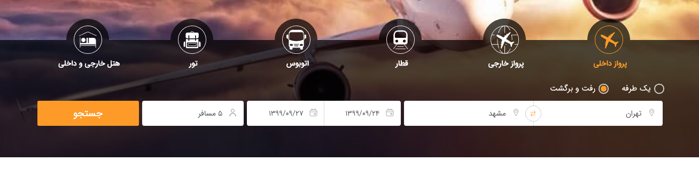
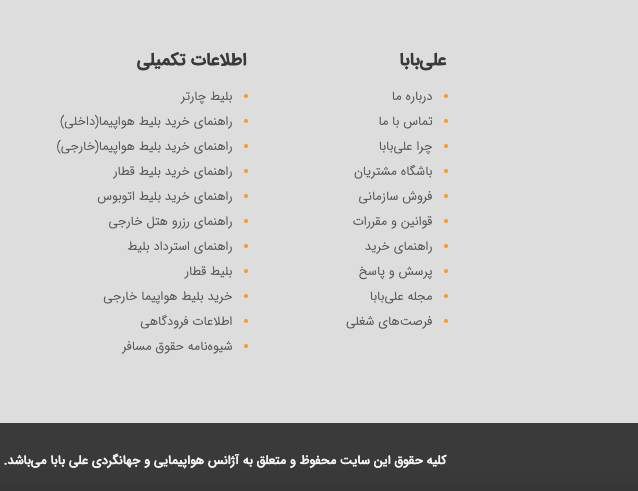

# Alibaba Search

## The challenge

Your task is to write a test using [Cypress](https://www.cypress.io/) that carries out a search action on [https://www.alibaba.ir](https://www.alibaba.ir).

## What the test should do

- Write a test that opens [https://www.alibaba.ir](https://www.alibaba.ir) and fills the data like the image below:

- Click on the "جستجو" button.

- Wait until the results are finished.

- Scroll to the bottom of the page and click on "تماس با ما" in the footer. (This scroll must be done as if the mouse was scrolling)

## What do we expect?
- We expect you to detect the test scenarios and create comfortable test suites and test cases.
- We expect you to have solutions for re-using cypress commands.
- We expect you to handle some edge cases which demonstrate your abilities with cypress timeouts.
- We expect you to keep your test scenarios clean and of course reliable.

## Sharing your solution

Please reply to the email you received with a link to a GitHub repository that contains your code. This repository needs a `README.md` file that explains everything we need to know.

## Giving feedback

Feedback is always welcome, so if you have any to give on this challenge please email frontend[at]alibaba[dot]ir.

**Have fun building!** 🚀
